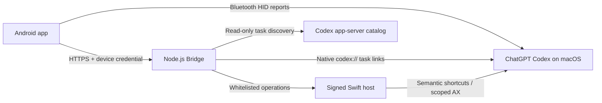

# Vibe Pocket

[](#requirements)
[](#requirements)
[](#requirements)
[](CONTROL_TRANSPORT.md)
[](#project-status)

Vibe Pocket turns an Android phone into a programmable control surface for
Codex on macOS. It combines Bluetooth HID keyboard reports with a local,
authenticated Bridge for task-aware operations that cannot be expressed as
ordinary shortcuts.

Vibe Pocket is a controller, not a screen mirror or remote shell. Task contents,
conversation history, credentials, and arbitrary keyboard or shell input are
not exposed to the phone.

This is an independent, unofficial project inspired by
[OpenMicro](https://github.com/stephenleo/OpenMicro) and the
[Codex Micro collaboration](https://openai.com/supply/co-lab/work-louder/). It
is not affiliated with or endorsed by OpenAI, Work Louder, Apple, Google, or
Xiaomi.

## Highlights

- **Hybrid control:** latency-sensitive frontmost actions use Bluetooth HID;
  task-aware actions use authenticated semantic commands.
- **Single-screen control:** active agents, a directional pad, common actions,
  model and reasoning controls, and workflows share one control surface.
- **Programmable surface:** six layers with independent tap, double-tap, and
  hold mappings.
- **Codex-native voice:** push-to-talk controls the ChatGPT desktop dictation
  action instead of recording audio inside Vibe Pocket.
- **Workflow controls:** launch configurable review, debug, refactor, and test
  prompts from four always-visible controls.
- **Reasoning control:** rotate the dial to move one available reasoning level;
  tap its center to open the native model picker.
- **One-action pairing:** a short-lived invitation discovers the Tailscale
  origin and issues a separate device credential without exposing
  the Mac administration secret.

## How It Works



Vibe Pocket deliberately chooses the narrowest available transport for each
operation:

| Path | Used for | Important property |
| --- | --- | --- |
| Bluetooth HID | Accept, Reject, Stop, Voice, navigation, mode, reasoning | Standard keyboard reports; no Bridge round trip |
| Native task links | Agent and task switching | Uses the exact Codex thread ID; no pointer synthesis |
| Authenticated Bridge | New task, Clear, Access, workflows, profile changes | Strict command and configuration schemas |
| Swift host | Visible controls without a stable shortcut | Whitelisted AX press/value operations; never moves the pointer |
| Codex app-server | Read-only task catalog | Does not create or resume hidden tasks during discovery |

For the detailed transport decision, see
[CONTROL_TRANSPORT.md](CONTROL_TRANSPORT.md).

## Requirements

### Mac

- macOS 14 or newer
- ChatGPT desktop with a Codex task view
- A signed-in [Codex CLI](https://github.com/openai/codex)
- Node.js 22 or newer
- Xcode Command Line Tools or another working Swift compiler
- Bluetooth and an unlocked graphical user session

### Android

- Android 10 or newer
- Bluetooth HID Device support from the device firmware
- Nearby devices permission on Android 12 or newer

### Network

The Android app accepts HTTPS Bridge URLs only. Tailscale Serve is the
recommended way to expose the loopback Bridge privately; another trusted HTTPS
reverse proxy can be used instead.

Building the Android app also requires JDK 17 and an Android SDK that provides
API level 37.

## Quick Start

### 1. Clone the repository

```sh
git clone git@github.com:mtics/Vibe-Pocket.git
cd Vibe-Pocket
```

### 2. Install the macOS Bridge

Choose the workspace that Vibe Pocket is allowed to control:

```sh
cd bridge
npm install
VIBE_POCKET_WORKSPACE="$HOME/path/to/workspace" \
  ./bin/install-launch-agent.sh
```

The installer:

- generates a Mac-only Bridge administration secret when one is not supplied;
- copies the Bridge runtime into the user Application Support directory;
- builds and ad-hoc signs **Vibe Pocket Bridge Host.app**;
- installs a user LaunchAgent;
- installs the fixed Codex semantic shortcuts; and
- waits until the local health endpoint responds.

Grant Accessibility permission once to **Vibe Pocket Bridge Host** under
**System Settings > Privacy & Security > Accessibility**. The installed app is
located at:

```text
~/Library/Application Support/Vibe Pocket/Vibe Pocket Bridge Host.app
```

Confirm that the service is healthy:

```sh
curl http://127.0.0.1:4320/healthz
launchctl print gui/$UID/au.edu.uts.vibepocket.bridge
```

### 3. Provide private HTTPS access

With Tailscale installed and connected on both devices:

```sh
tailscale serve --https=443 --bg http://127.0.0.1:4320
tailscale serve status
```

If the CLI is not in `PATH` on macOS, use
`/Applications/Tailscale.app/Contents/MacOS/Tailscale` in place of `tailscale`.

Do not enable Tailscale Funnel; the Bridge is intended for private tailnet
access only. Vibe Pocket discovers the matching root Serve handler when a
pairing invitation is created.

### 4. Build and install the Android app

```sh
cd ../android
./gradlew testDebugUnitTest lintDebug assembleDebug
adb install -r app/build/outputs/apk/debug/app-debug.apk
```

If Gradle cannot locate the toolchain, export `JAVA_HOME` for JDK 17 and set
`ANDROID_HOME` to the local Android SDK before running the build.

### 5. Pair Vibe Pocket

```sh
~/.local/bin/vibe-pocket-pair
```

The installer also creates **Pair Vibe Pocket.app** in `~/Applications`, so
the same pairing flow can be started from Finder or Spotlight without a
terminal.

When one authorized ADB device is connected, the command opens the invitation
directly on that phone. Otherwise, it opens a QR window on the Mac. The
invitation expires after five minutes and can be claimed only once.

On the phone, confirm the displayed Mac address and tap **Pair**. Vibe Pocket
stores the resulting per-device credential with Android Keystore encryption.
Normal setup never asks for a URL or key. **Recovery details** accepts a complete
short-lived invitation, while **Advanced connection** can retain the current
device credential when only the Bridge URL changes.

Then configure Bluetooth HID:

1. Open **Settings > Virtual hardware** and tap **Pair**.
2. Allow Nearby devices access when Android requests it.
3. Open macOS Bluetooth settings and pair the phone as a keyboard.
4. Return to Vibe Pocket and select the paired Mac if it was not selected
   automatically.

## Using the Controller

The main Control screen keeps the complete working surface in one place:

| Surface | Purpose |
| --- | --- |
| Agent rail | Show the focused task first, then active tasks by status and recent activity |
| Direction pad | Navigate Codex without a separate key page |
| Common actions | Accept, Reject, Voice, Clear, Stop, task creation, focus, mode, and access |
| Model and reasoning | Open the model picker and adjust the available reasoning level |
| Workflows | Start one of four editable prompts in a new visible Codex task |
| L1 layer chord | Hold L1 with a mapped key to select one of six controller layers |

Settings is a modal surface for Bluetooth host selection, layer names and
colors, gesture mappings, workflow prompts, and advanced connection recovery.
Normal pairing does not expose or require credentials.

## Configuration

The LaunchAgent installer accepts these environment variables:

| Variable | Default | Purpose |
| --- | --- | --- |
| `VIBE_POCKET_TOKEN` | Generated on first install | Mac-only administration secret; must contain at least 24 characters |
| `VIBE_POCKET_PORT` | `4320` | Loopback Bridge port |
| `VIBE_POCKET_WORKSPACE` | Repository root | Workspace the controller may operate in |
| `VIBE_POCKET_CODEX_COMMAND` | First `codex` in `PATH` | Codex CLI executable |
| `VIBE_POCKET_NODE` | First `node` in `PATH` | Node.js executable |
| `VIBE_POCKET_SWIFTC` | `/usr/bin/swiftc` | Swift compiler |

For direct runtime configuration and multi-workspace JSON, see
[`bridge/.env.example`](bridge/.env.example).

Runtime state is stored outside the repository:

| Path | Contents |
| --- | --- |
| `~/Library/Application Support/Vibe Pocket/bridge.env` | Mode-`0600` Bridge configuration and administration secret |
| `~/Library/Application Support/Vibe Pocket/controller-profile.json` | Layers, mappings, colors, and workflow prompts |
| `~/Library/Application Support/Vibe Pocket/owned-threads.json` | Bounded set of task IDs owned by Vibe Pocket |
| `~/Library/Application Support/Vibe Pocket/paired-devices.json` | Mode-`0600` hashes of issued device credentials |
| `~/Library/Application Support/Vibe Pocket/pairing.sock` | Mode-`0600` local invitation-creation socket |
| `~/Library/Application Support/Vibe Pocket/runtime` | Installed Bridge runtime |
| `~/Library/Logs/Vibe Pocket` | LaunchAgent output and errors |

## Security Model

- The Bridge binds to `127.0.0.1`; remote access is expected to come from a
  private HTTPS proxy.
- Invitation creation is available only through a mode-`0600` Unix socket.
  Tailscale Serve exposes the short-lived claim endpoint, never the Mac
  administration credential.
- Each phone receives an independent bearer credential. The Bridge persists
  only its SHA-256 hash; `/healthz` exposes only service and protocol metadata.
- Controller actions and mappings are validated against a fixed semantic
  whitelist. There is no raw keyboard, arbitrary Accessibility, or shell
  endpoint.
- The Swift host performs only known shortcuts and scoped AX press/value
  operations. It never synthesizes pointer movement.
- Agent focus uses stable opaque IDs derived from real thread IDs. Ambiguous or
  stale visible task labels are rejected.
- Workflow prompts are bounded and persisted locally. Normal workflow presses
  send only a workflow ID.
- Android stores its device credential with an Android Keystore AES-GCM key and
  does not request microphone, location, or Bluetooth scanning permission.
- Only an explicit Attach or task selection may bring ChatGPT forward; ordinary
  control actions do not intentionally activate it.

## Project Structure

```text
Vibe-Pocket/
|-- android/                  Android controller and Bluetooth HID transport
|   `-- app/src/main/java/au/edu/uts/vibepocket/
|       |-- bridge/           Authenticated HTTP and event transport
|       |-- connection/       Saved connection configuration
|       |-- control/          Protocol commands and snapshots
|       |-- gesture/          Dial, release, and layer policies
|       |-- hid/              Bluetooth keyboard and HID reports
|       |-- input/            Pure planning and transport dispatch
|       |-- profile/          Layers, mappings, and workflows
|       |-- session/          Connection and command orchestration
|       `-- ui/               Compose feature surfaces
|-- bridge/
|   |-- src/codex/            Codex RPC, tasks, settings, turns, and intent
|   |-- src/control/          Command, queue, refresh, state, and session flow
|   |-- src/macos/            Signed host, pairing window, and desktop adapter
|   |-- src/pairing/          Invitations and device credentials
|   |-- src/profile/          Profile validation and persistence
|   |-- src/server/           Authenticated HTTP and event server
|   `-- src/task/             Task discovery, activity, ownership, and links
`-- CONTROL_TRANSPORT.md      Transport decision and compatibility boundary
```

Directory context carries domain meaning, so local types intentionally use
short names such as `Session`, `State`, `Tasks`, and `Intent`. Business flow is
expressed by composing these functional units instead of concentrating behavior
in product-prefixed controller classes.

## Development

Run Bridge tests:

```sh
cd bridge
npm test
```

Run Android unit tests, lint, and a debug build:

```sh
cd android
./gradlew testDebugUnitTest lintDebug assembleDebug
```

The current verified baseline contains 107 passing Bridge tests and 67 passing
Android JVM tests. The Swift host also passes standalone type checking.

## Troubleshooting

### Bridge is unreachable

```sh
curl http://127.0.0.1:4320/healthz
launchctl print gui/$UID/au.edu.uts.vibepocket.bridge
tail -n 100 "$HOME/Library/Logs/Vibe Pocket/bridge-error.log"
```

If localhost works but the phone cannot connect, inspect `tailscale serve
status` and confirm that the phone uses the HTTPS URL rather than the loopback
address.

### Controls are unavailable

- Keep the Mac unlocked with a Codex task visible in ChatGPT.
- Confirm that **Vibe Pocket Bridge Host** still has Accessibility permission.
- Reload Codex once after the first semantic-shortcut installation.
- Re-run `bridge/bin/install-launch-agent.sh` after updating the repository.

### Bluetooth HID does not connect

- Confirm that Nearby devices permission is granted.
- Remove stale pairings on both devices, tap **Pair** again, and pair from macOS.
- Some Android firmware does not expose the HID Device profile even when the OS
  version is supported.

## Project Status

Vibe Pocket is experimental and currently targets an Android phone controlling
Codex on macOS. Important limitations include:

- the host implementation is macOS-specific;
- visible AX operations require an unlocked user session;
- HID registration and the event connection are maintained while the Android
  app is in the foreground;
- USB-C keyboard gadget mode is not supported by the stock Android app; and
- task contents are intentionally not mirrored to the phone.

The repository does not currently include an open-source license. Unless a
license is added, the source remains subject to the repository owner's rights.
